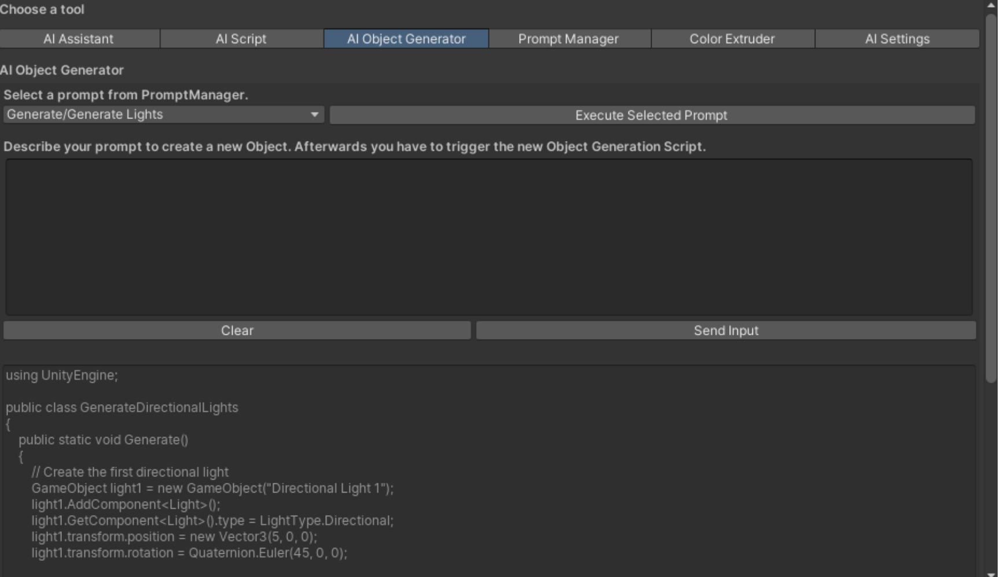

# UnityEditorAI
 
# Unity AI Assistant – Natural Language Automation for Unity Development

## Overview

**Unity AI Assistant** is a Unity Editor extension developed as part of a Bachelor's thesis in cooperation with Capgemini Germany.  
It integrates large language models (LLMs) into the Unity Editor to allow the creation of Unity objects, components, and scripts based on natural language prompts.  
The tool streamlines repetitive development tasks and supports Unity developers with intelligent code and object generation.

> 🧠 Powered by OpenAI's GPT API  
> 🧰 Built for Unity 2022.3 (LTS)

---

## Key Features

- 🧾 **Script Generator**  
  Generate Unity-compatible C# scripts based on a simple textual prompt.

- 🧱 **Object Generator**  
  Automatically create GameObjects with predefined components (e.g., Rigidbody, Collider) via natural language input.

- 🎨 **Color Theme Assistant**  
  Apply color schemes and UI themes using descriptive commands.

- 💬 **Prompt Manager**  
  Reuse, edit, and manage prompts within the editor interface.

- 🔧 **Custom Editor Window Integration**  
  Fully integrated into Unity’s Editor with intuitive layout and modular structure.

---

## Screenshots

**AI Script Generator**  

**Object Generator Example**  

**Prompt Manager Interface**  

---

## Technologies Used

- **Unity 2022.3 LTS**
- **C#**
- **OpenAI API (GPT-3.5 / GPT-4)**
- **Newtonsoft JSON**
- **UniTask (asynchronous workflows)**
- **Custom Unity EditorWindow architecture**

---

## Project Structure
Assets/
│
├── Editor/
│ ├── AI-Assistant/ # Main tool modules
│ ├── OpenAI-Integration/ # API handling & messaging
│ ├── Utilities/ # Prompt management, file handling, etc.
│ └── GUI/ # Editor UI layout and visuals
└── Resources/
└── DefaultPrompts.json

## Usage

1. Clone or download the repository into your Unity project.
2. Open Unity and go to `Window > AI Assistant`.
3. Insert your OpenAI API key in the settings.
4. Start generating objects or scripts using descriptive English prompts.

---

## Example Prompts

- `"Create a flying enemy script that follows the player"`
- `"Add a blue cube with rigidbody and box collider"`
- `"Apply a sci-fi color palette to the scene"`

---

## Limitations

- Requires active internet connection and valid OpenAI API key
- Prompt output may occasionally require manual adjustment
- Designed for prototyping and support – not intended to fully replace manual scripting

---

## Author

**Enis Uysal**  
B.Sc. Human-Technology Interaction – Hochschule Ruhr West  
In cooperation with **Capgemini Deutschland GmbH**

---

## License

🚫 Due to university and industry collaboration, this repository may be *restricted**. Please contact the author for inquiries.  
*All rights reserved.*

---

## Acknowledgments

- Hochschule Ruhr West – Prof. Dr. Sabrina Eimler, Daniel Lichtwald  
- Capgemini Germany – Project Partner & Feedback  
- Unity Technologies – Editor API & Documentation  
- OpenAI – Language Model Integration

